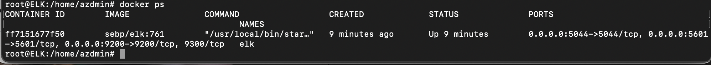

## Automated ELK Stack Deployment

The files in this repository were used to configure the network depicted below.

These files have been tested and used to generate a live ELK deployment on Azure. They can be used to either recreate the entire deployment pictured above. Alternatively, select portions of the .yml file, provided below, may be used to install only certain pieces of it, such as Filebeat.

- [yml_Playbooks](/yml_Playbooks/) 

This document contains the following details:
- Description of the Topology
- Access Policies
- ELK Configuration
  - Beats in Use
  - Machines Being Monitored
- How to Use the Ansible Build

### Description of the Topology

The main purpose of this network is to expose a load-balanced and monitored instance of DVWA, the D*mn Vulnerable Web Application.

Load balancing ensures that the application will be highly available, in addition to restricting inbound access to the network.

- The load balancer protects the network from DDoS attacks by distributing traffic evenly amongst the virtual machines. 
- The Jump Box is a single point of access within the network that is only available to the administrator. Additionally, a single point of access is easier to monitor for potential attacks.

Integrating an ELK server allows users to easily monitor the vulnerable VMs for changes to the file system and system metrics.

- Filebeat tails and monitors log files within the assigned virtual machines and sends the logs to either Logstash for further processing or to Elasticsearch for indexing. The resulting data may then be compiled and viewed through Kibana.
- Metricbeat collects the statistics and metrics from the network, including CPU usage, memory, file system, etc.

The configuration details of each machine may be found below.

| Name     | Function    | IP Addresses | Operating System     |
|----------|-------------|--------------|----------------------|
| Jump Box | Gateway     | 10.0.0.4     | Linux (ubuntu 18.04) |
| Web-1    | Web Servers | 10.0.0.5     | Linux (ubuntu 18.04) |
| Web-2    | Web Servers | 10.0.0.6     | Linux (ubuntu 18.04) |
| Web-3    | Web Servers | 10.0.0.7     | Linux (ubuntu 18.04) |
| ELK      | Monitoring  | 10.1.0.5     | Linux (ubuntu 18.04) |

### Access Policies

The machines on the internal network are not exposed to the public Internet. 

Only the Jump Box machine can accept connections from the Internet. Access to this machine is only allowed from the following IP addresses:

- The administrator's personal IP address is the only address with access to the Jump Box machine.

Machines within the network can only be accessed by the Jump Box VM.

- The Jump Box machine, with the private IP 10.0.0.4, has access to every machine within the network, including the ELK sever.

A summary of the access policies in place can be found in the table below.

| Name     | Publicly Accessible | Allowed IP Addresses   |
|----------|---------------------|------------------------|
| Jump Box | No                  | Personal IP            |
| Web-1    | No                  | 10.0.0.4               |
| Web-2    | No                  | 10.0.0.4               |
| Web-3    | No                  | 10.0.0.4               |
| ELK      | No                  | 10.0.0.4 & Personal IP |

### Elk Configuration

Ansible was used to automate configuration of the ELK machine. No configuration was performed manually, which is advantageous because...

- The automated configuration is ideal because it minimalizes the chance of errors and impliments the configuration at a faster pace. Going forward, the preconfigured files can also be easily edited with future updates.

The playbook implements the following tasks:
- First Task: install docker.io
- Second Task: install python3
- Third Task: install docker module
- Fourth Task: increase the virtual memory
- Fifth Task: download and launch the docker ELK container
- Sixth Task: docker on boot (this command makes sure that docker is automatically started everytime the webservers are booted up)

The following screenshot displays the result of running `docker ps` after successfully configuring the ELK instance.

### Target Machines & Beats
This ELK server is configured to monitor the following machines:
- Web-1: 10.0.0.5
- Web-2: 10.0.0.6
- Web-3: 10.0.0.7

We have installed the following Beats on these machines:
- Filebeat
- Metricbeat

These Beats allow us to collect the following information from each machine:

- Filebeat tracks and collects system and file logs. By collecting this data, Filebeat can log all failed and accepted SSH login attempts. 
- Metricbeat collects staistics and metrics for the webserver machines. Through this data we can monitor CPU usage, memory, diskIO, and the number of docker containers per machine.

### Using the Playbook
In order to use the playbook, you will need to have an Ansible control node already configured. Assuming you have such a control node provisioned: 

SSH into the control node and follow the steps below:

- Locate the name of your ansible container by running: docker container list -a 
- To activate and attach to your ansible run the following commands: 
  
  docker start (container name)  
  
  docker attach (container name) 
  
- Once you are in your anisible container you will need to navigate to ~/etc/ansible. 
- Copy the [.yml](/yml_Playbooks/) files to the ansible directory in /etc/.
- Update the hosts file to include the webserver IPs and the elk server IP, this is done so the playbook will run on the correct machines. Run the following commands to edit the hosts file:
  
 - nano hosts
  
  Once you are within the hosts file you will need to edit the file starting at line #20. You will need to add the names of the different servers in braces and       then add the corresponding private IP addresses below the names. Example provided below:
  
  [webservers]

  10.0.0.5 ansible_python_interpreter=/usr/bin/python3

  12.0.0.6 ansible_python_interpreter=/usr/bin/python3

  14.0.0.7 ansible_python_interpreter=/usr/bin/python3

  [elk]

  10.1.0.5 ansible_python_interpreter=/usr/bin/python3

- After editing the hosts file, you will need to create a connection to the webservers and elk server by SSHing into every machine. This will establish a connection from ansible to each virtual machine.

  ssh (username)@10.0.0.5

- After creating a connection to each machine, make sure you copy the filebeat-config and metricbeat-config files to the ansible directory as well. They are avaible in the [.yml playbook folder](/yml_Playbooks/).
- The config files will need editing within the "Elasticsearch output" and the "Kibana" sections. 
- Within the "Elasticsearch output" section you will change the "hosts" to <["elk private IP:9200"]>
- Within the "Kibana" section you will change the "hosts" to <["elk private IP:5601"]>

Example below:

- nano filebeat-config.yml 

You can use the keyboard command 'control+w' to search for the key words "output.elasticsearch" and "setup.kibana":

- Elasticsearch Example:

  hosts: ["10.1.0.5:9200"]
  
- Kibana Example:
  
  host: "10.1.0.5:5601"
  
- The metricbeat-config file is edited the same way as indicated above.
- Once both config files have been edited you may start running the playbooks that you copied to the ansible directory.

The following commands will run each playbook:
  
  - ansible-playbook docker-playbook.yml
  - ansible-playbook elk-playbook.yml
  - ansible-playbook filebeat-playbook.yml
  - ansible-playbook metricbeat-playbook.yml

After running each playbook, navigate to http://(Elk-Server PublicIP):5601/app/kibana to check that the installation worked as expected. 
  - Examples of the Kibana home page and the Filebeat/Metricbeat data pages are available in the [Kibana Folder](/Kibana/).
